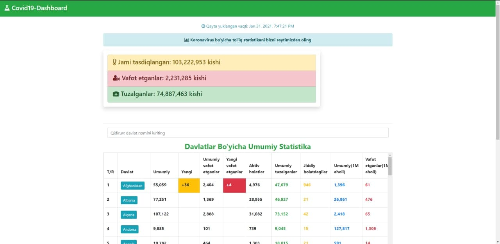

# Covid19-Dashboard🦠

### Qo'llanma (uz):

**Covid19-Dashboard** - butun jahon bo'yicha koronavirusga oid bo'lgan statistikalarni yetkazib beruvchi veb ilova. Ushbu veb ilova **Angular JS** freymvorkida yozilgan. Hamda uni ishga tushurish uchun sizda ushbu freymvork o'rnatilgan bo'lishi lozim. Undan oldin esa sizda **nodejs** hamda **npm** o'rnatilgan bo'lishi kerak.

>- nodejs - https://nodejs.org/en/download/
>- npm - **nodejs**ning ichida

**Nodejs** va **npm** o'rnatilganligini tekshirish:

```bash
$ node -v
v14.15.3
$ npm -v
v6.14.9
```

### O'rnatish

Ushbu repozitoriyani klonlashtirib oling:

```bash
$ git clone https://github.com/AbduazizZiyodov/Covid19-Dashboard.git
$ cd Covid19-Dashboard
```
**Angular CLI**ni o'rnating:
```bash
$ npm install -g @angular/cli
```
Qolgan barcha kerakli modullarni o'rnatib olish uchun quyidagi buyruqni kiriting:
```bash
$ cd Covid19-Dashboard
$ npm install
```

Serverni ishga tushurish uchun esa ushbu buyruqni kiriting:

```bash
$ ng serve
```

So'ng, http://localhost:4200/ bo'yicha o'ting:



<hr>

>Ushbu loyiha **"OMUC talabalari uchun tashkillashtirilgan intensiv kurs"** orqali tayyorlandi.
**Mentor:** Ulugbek Samigjonov
